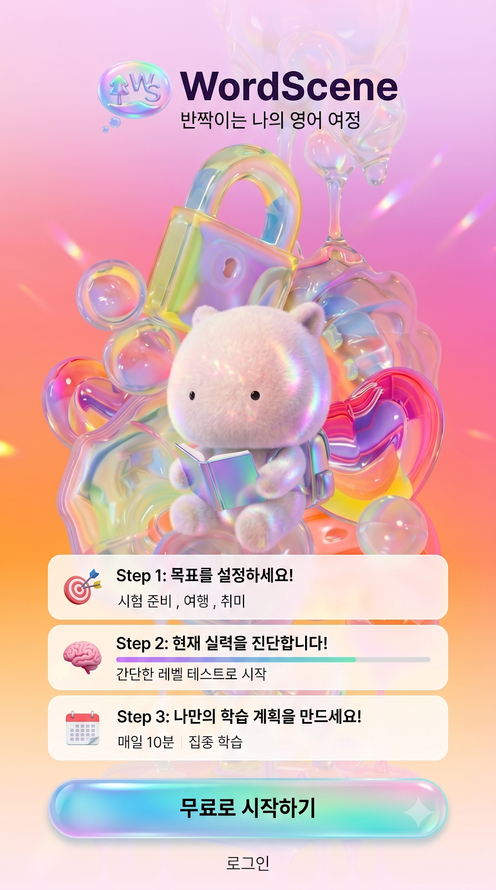

<p align="center">
  
  
  
  
  
  
  
  
</p>

# WordScene

**고전 문학·영화 명대사의 실제 원문과 한국어 번역으로 영어를 학습하는 웹 앱입니다.**

빈칸 채우기, 단어 배열, 번역 선택 3종 문제를 통해 셜록 홈즈, 프랑켄슈타인, 오만과 편견 같은 실제 공개 저작물 문장을 학습합니다. Supabase에 저장된 검수 완료 문장을 실시간으로 불러오며, AI(Gemini)가 문장 기반 대화 튜터와 자동 문제 생성을 보조합니다.

<p align="center">
  
</p>

## 주요 기능

- 📚 **실제 원서·영화 콘텐츠 학습**: Supabase에 등록되고 관리자가 승인(`review_status = selected`)한 문장만 서비스에 노출
- ✍️ **3종 문제 유형**: 빈칸 채우기 / 단어 배열 / 번역 선택, 결정론적 알고리즘으로 동일 입력에 동일 결과 생성
- 🔥 **진도·XP·스트릭 저장**: 브라우저에 발급된 익명 ID(`localStorage`)를 기준으로 Supabase에 학습 진도와 복습 목록을 백업 — 로그인 계정이 아니므로 브라우저 저장소를 지우거나 다른 브라우저/기기로 옮기면 진도가 새로 시작됩니다
- 🤖 **AI 문장 튜터**: Gemini 기반 대화형 튜터가 문장 해석·문법을 설명 (Edge Function)
- 🔊 **TTS 음성 재생**: 사용자가 버튼을 눌렀을 때만 문장을 읽어주는 음성 지원 (Gemini TTS, 실패 시 브라우저 음성으로 자동 폴백)
- 🛠️ **관리자 검수 파이프라인**: 패스코드 기반 관리자 화면에서 후보 문장 승인/거부, AI "생성 → 검증 → 저장" 문제 생성 워크플로
- 📴 **오프라인/미연결 폴백**: Supabase 연결 실패 시 내장 체험 데이터로 자동 전환되어 앱이 항상 동작

## 디렉터리 구조

단일 React/Vite 앱(모노레포 아님)이며, 프론트엔드(`src/`)와 Supabase Edge Functions(`supabase/functions/`)가 한 저장소·한 `package.json`으로 관리됩니다. Edge Function은 Deno 런타임이라 프론트엔드와 의존성이 완전히 분리되어 있고, 프론트엔드는 REST(`fetch`)로만 호출합니다.

```text
WordScene_test_package_v2/
├── src/
│   ├── components/
│   │   ├── common/        # Header, BottomNav, Sidebar, Toast
│   │   ├── explore/       # 작품 탐색 화면
│   │   ├── history/       # 학습 기록
│   │   ├── home/          # 홈 ("오늘의 학습")
│   │   ├── layout/        # AppShell (전체 레이아웃)
│   │   ├── learn/         # 학습 세션, AI 튜터 패널, 결과 화면
│   │   ├── onboarding/    # 첫 진입 온보딩
│   │   ├── profile/       # 프로필, 관리자 검수 패널
│   │   └── review/        # 복습 센터
│   ├── context/AppContext.tsx  # 전역 상태 (세션, 진도, XP, 리뷰 등)
│   ├── data/mockData.ts        # Supabase 미연결 시 쓰는 체험 데이터
│   ├── lib/
│   │   ├── adminReview.ts      # 관리자 검수용 Edge Function 호출
│   │   ├── aiTutor.ts          # sentence-tutor Edge Function 호출
│   │   ├── contentService.ts   # 콘텐츠 로딩 + 결정론적 문제 생성 핵심 로직
│   │   ├── deviceId.ts         # 익명 기기 ID 발급/저장
│   │   └── progressService.ts  # 진도·XP Supabase 동기화
│   ├── utils/speech.ts         # TTS (서버 우선, 브라우저 폴백)
│   ├── App.tsx / main.tsx / types.ts / index.css
├── supabase/
│   ├── functions/              # Edge Functions (Deno)
│   │   ├── admin-review/       # 콘텐츠 승인/거부
│   │   ├── generate-question/  # AI 문제 "생성 → 검증 → 저장"
│   │   ├── sentence-tutor/     # AI 대화 튜터
│   │   └── text-to-speech/     # Gemini TTS 프록시
│   └── migrations/             # 증분 스키마 마이그레이션 (기본 스키마는 미포함 — 아래 참고)
├── tests/                      # Playwright E2E 스모크 테스트
├── public/                     # 정적 자산 (파비콘, 스크린샷 등)
├── vercel.json                 # Vercel 배포 설정 (pnpm 빌드)
├── playwright.config.ts
└── package.json
```

## 저작권 및 콘텐츠 사용 기준

### 고전 문학 (`book_contents`)

- **Project Gutenberg**에서 받은 퍼블릭 도메인 원문만 사용합니다.
- 모든 행에 출처를 나중에도 재검증할 수 있는 필드가 함께 저장됩니다: `source_url`(다운로드한 구텐베르크 원문 파일 URL), `source_sha256`(그 원문 파일 전체의 SHA-256), `quote_sha256`(인용 문장 자체의 SHA-256, DB에 **UNIQUE** 제약), `source_start`/`source_end`(정규화된 원문 내 문자 오프셋).
- 새 문장을 추가할 때는 "제공된 문장이 실제 원문의 정확한 부분 문자열인지"를 코드로 직접 대조한 뒤 일치하는 것만 반영합니다. 패러프레이즈되었거나 재구성된 문장은 채택하지 않습니다 — 실제로 이 저장소에서 외부 제공 SQL 100문장 중 74개가 이 검증에서 걸러진 사례가 있습니다 (아래 "새 공개 도메인 도서 추가하기" 참고).

### 영화 대사 (`movie_quotes_ko_en`)

- 영화 한 편당 매우 짧은 개별 대사 1문장 단위로만 저장하며(전체 대본이나 여러 문장을 연속으로 저장하지 않음), 언어 학습 해설(`notes` 컬럼, 예: `"타짜 = card sharp"`)을 함께 붙여 교육적 논평·인용 목적임을 명시합니다.
- ⚠️ 이는 현재의 운영 관행을 설명한 것이며, 미국 저작권법상 Fair Use 4요소(목적·성격, 저작물의 성격, 사용량과 상당성, 시장에 미치는 영향)에 대한 법률 검토를 거친 것은 **아닙니다**. 이 README의 설명은 법률 자문이 아니며, 상업적 서비스로 확장하기 전에는 반드시 법률 전문가의 검토를 받아야 합니다.

## 기술 스택

| 영역 | 사용 기술 |
| --- | --- |
| Frontend | React 19, TypeScript, Vite 8, Tailwind CSS v4 |
| 상태/데이터 | React Context, Supabase JS REST (PostgREST) |
| Backend/Infra | Supabase (Postgres, RLS, Edge Functions/Deno) |
| AI | Google Gemini API (JSON 모드 문제 생성, 대화 튜터, TTS) |
| 테스트 | Playwright (E2E 스모크 테스트) |
| 배포 | Vercel |
| 패키지 매니저 | pnpm 10 |

## 시작하기 및 설치

### 사전 요구사항

- Node.js 20 이상
- pnpm 10 이상 (`corepack enable` 후 자동 설치되거나 `npm i -g pnpm`)
- Chrome, Edge 또는 Safari 최신 버전

Node.js가 없다면 <https://nodejs.org/>에서 LTS 버전을 설치하세요.

### 1) 가장 빠른 실행 — 체험 데이터 모드

```bash
pnpm install
pnpm dev
```

브라우저에서 다음 주소를 엽니다.

```text
http://localhost:3000
```

Supabase 설정 없이도 내장된 체험 데이터로 모든 화면과 학습 흐름을 테스트할 수 있습니다.

> npm을 사용해도 됩니다: `npm install && npm run dev`

### 2) 데이터베이스 스키마 적용 (Supabase를 처음 구성하는 경우)

> ⚠️ `supabase/migrations/`에는 이후 추가된 기능(`device_progress`, `generated_questions`)의 증분 마이그레이션만 들어 있습니다. `works` / `book_contents` / `movie_quotes_ko_en` 등 기본 테이블과 RLS 정책은 아직 마이그레이션 파일로 정리되어 있지 않고, Supabase 대시보드 SQL Editor에서 직접 생성되었습니다. 이 저장소만으로 빈 프로젝트에서 완전히 재현할 수는 **아직** 없으며, 기본 스키마 SQL을 별도로 공유받거나 대시보드의 Table Editor로 동일한 구조를 직접 만들어야 합니다 (아래 "데이터 모델" 섹션의 컬럼 목록 참고).

기본 테이블이 이미 있는 프로젝트라면, 이후 추가된 마이그레이션만 적용하면 됩니다.

```bash
npx supabase login
npx supabase link --project-ref YOUR_PROJECT_REF
npx supabase db push
```

### 3) Supabase 콘텐츠 연결

프로젝트 루트에서 `.env.example`을 `.env.local`로 복사합니다.

```bash
# Windows PowerShell
Copy-Item .env.example .env.local

# macOS/Linux
cp .env.example .env.local
```

`.env.local`에 Supabase Project Settings → API의 값을 입력합니다.

```dotenv
VITE_SUPABASE_URL=https://YOUR_PROJECT.supabase.co
VITE_SUPABASE_ANON_KEY=YOUR_ANON_KEY
```

> `service_role`/`sb_secret_...` 키는 절대 브라우저용 환경변수(`VITE_` 접두사)에 넣지 마세요. Supabase 게이트웨이가 브라우저 컨텍스트에서의 시크릿 키 사용을 차단합니다.

설정 후 개발 서버를 다시 시작합니다.

```bash
pnpm dev
```

앱은 다음 데이터를 읽습니다.

- `works`: 작품명, 저자, 정렬 순서
- `book_contents` / `movie_quotes_ko_en`: `review_status = selected`인 학습 문장
- `generated_questions`: 관리자가 승인한 AI 생성 문제(있는 경우 결정론적 문제를 대체)

Supabase 연결 또는 조회에 실패하면 앱은 자동으로 체험 데이터 모드로 전환됩니다.

### 4) Edge Functions (선택)

AI 문장 튜터, TTS, 관리자 검수, AI 문제 생성은 Supabase Edge Functions로 동작합니다. 배포 전에 시크릿부터 등록해야 합니다 — 등록하지 않으면 함수가 배포는 되어도 호출 시점에 즉시 에러를 반환합니다.

```bash
npx supabase secrets set GEMINI_API_KEY=YOUR_GEMINI_KEY --project-ref YOUR_PROJECT_REF
npx supabase secrets set ADMIN_PASSCODE=YOUR_ADMIN_PASSCODE --project-ref YOUR_PROJECT_REF
```

`SUPABASE_URL`/`SUPABASE_SERVICE_ROLE_KEY`는 Supabase 플랫폼이 모든 Edge Function에 자동 주입하므로 별도로 설정하지 않습니다.

```bash
npx supabase functions deploy sentence-tutor --project-ref YOUR_PROJECT_REF
npx supabase functions deploy text-to-speech --project-ref YOUR_PROJECT_REF
npx supabase functions deploy admin-review --project-ref YOUR_PROJECT_REF
npx supabase functions deploy generate-question --project-ref YOUR_PROJECT_REF
```

> ⚠️ `admin-review`/`generate-question`의 `ADMIN_PASSCODE`는 개인 프로젝트 수준의 최소한의 접근 제어이며 브루트포스 방어(레이트 리밋, 시도 횟수 제한)가 없습니다. 실제 다중 관리자 운영에 쓰려면 Supabase Auth + RLS 기반 역할 검증으로 교체하는 것을 권장합니다.

## 데이터 모델

```text
works (id PK) ──< book_contents (work_id FK → works.id, quote_sha256 UNIQUE)

generated_questions (source_table, source_id)
   → book_contents.candidate_id 또는 movie_quotes_ko_en.id 중 하나를 가리킴
   ※ source_table로 두 테이블 중 하나를 구분하는 다형적 참조이며,
     실제 DB 레벨 FK 제약은 없고 애플리케이션 코드로만 정합성을 유지합니다.

movie_quotes_ko_en (id PK)   — works와 관계 없는 독립 테이블
device_progress (device_id PK) — works/book_contents와 FK 없이 독립 저장
```

| 테이블 | 주요 컬럼 | 비고 |
| --- | --- | --- |
| `works` | `id`(PK, text), `title`, `author`, `sort_order` | 예: `BOOK_HP_1888` |
| `book_contents` | `candidate_id`(PK), `work_id`(FK→`works.id`), `no_in_work`, `original_text`, `translation_ko`, `selection_score`, `segment_id`/`source_url`/`source_sha256`/`quote_sha256`(**UNIQUE**), `review_status` | `selection_score`가 높은 상위 3문장이 실제 문제로 노출 |
| `movie_quotes_ko_en` | `id`(PK, bigint), `movie_title`, `quote_no`, `original_ko`, `translation_en`, `notes`, `review_status` | |
| `generated_questions` | `id`(PK identity), `source_table`(CHECK: `book_contents`\|`movie_quotes_ko_en`), `source_id`, `question_type`(CHECK: `fill_blank`\|`word_order`\|`translation_match`), `options`/`correct_answer`(jsonb), `review_status` | AI 생성, 관리자 승인 후에만 노출 |
| `device_progress` | `device_id`(PK, text), `total_xp`, `streak_days`, `work_progress`(jsonb) | `device_id`는 `localStorage` UUID — 로그인 계정 아님 |

> **`review_status` 생애주기**: 모든 콘텐츠 테이블이 동일한 3단계를 따릅니다. **`drafted`**(후보, 미노출) → 관리자 승인 → **`selected`**(서비스 노출) 또는 **`rejected`**(폐기). `book_contents`/`movie_quotes_ko_en`은 최초 등록 시부터, `generated_questions`도 AI 생성 직후부터 `drafted`입니다.

> **RLS 모델**: `anon` 롤에는 읽기만(또는 `device_progress`처럼 "추측 불가능한 토큰" 신뢰 모델 하의 전체 CRUD) 허용됩니다. 실제 쓰기 권한이 필요한 검수·생성 작업은 전부 `service_role` 키를 쥔 Edge Function을 통해서만 이루어지며, `service_role` 키는 클라이언트에 노출되지 않습니다.

## AI 파이프라인 및 거버넌스

### "생성 → 검증 → 저장" 워크플로 (`generate-question`)

1. Gemini `generateContent`를 JSON 모드(`responseMimeType: 'application/json'` + `responseSchema`)로 호출해 응답 구조를 1차로 강제합니다.
2. 커스텀 규칙 기반 validator로 2차 검증합니다 (Zod 등 별도 스키마 검증 라이브러리는 사용하지 않음):
   - `fill_blank`: 정답 단어가 원문에 실제로 존재하는지, 보기 4개(정답+오답 3)가 중복 없는지
   - `word_order`: 생성된 단어 목록을 토큰화·정렬해 원문의 단어 구성과 정확히 일치하는지
   - `translation_match`: 오답 3개가 정답과 중복되지 않는지
3. 검증에 실패하면 아무것도 저장하지 않고 에러(`validationNotes`)를 반환합니다. 통과분만 `generated_questions`에 `review_status='drafted'`로 저장되어 관리자 승인을 기다립니다.
4. 관리자가 승인하기 전까지 앱은 항상 `contentService.ts`의 결정론적 생성 로직을 그대로 사용합니다 — AI 결과가 검증·사람 승인 없이 사용자에게 노출되는 경로는 없습니다.

### 비용·레이트 리밋 — 알려진 한계

각 Edge Function은 **한 번의 요청 크기**는 제한합니다 — `sentence-tutor`는 사용자 메시지 500자(`MAX_MESSAGE_LENGTH`)·대화 기록 20턴(`MAX_HISTORY_TURNS`)·Gemini 응답 512토큰(`maxOutputTokens`), `text-to-speech`는 입력 텍스트 300자(`MAX_TEXT_LENGTH`)를 넘으면 거부합니다. 다만 이건 요청 1건의 크기 제한일 뿐이고, **요청 빈도**(같은 사용자가 몇 초에 몇 번 호출할 수 있는지)나 **일일/월간 사용자별 쿼터**는 `sentence-tutor` / `text-to-speech` / `generate-question` 어디에도 구현되어 있지 않습니다. `AiTutorPanel.tsx`는 응답 대기 중 전송 버튼을 비활성화하는 UI 가드만 있을 뿐, 서버 쪽 요청 빈도 제한(rate limiting)·디바운스는 없습니다. 다수 사용자에게 공개하기 전에는 Edge Function 레벨 요청 빈도 제한 또는 Gemini API 쿼터 정책으로 별도 방어가 필요합니다.

### TTS 폴백 상세

1. **서버 우선**: `text-to-speech` Edge Function(Gemini TTS)을 호출해 서버 합성 오디오를 재생합니다.
2. **브라우저 폴백**(서버 실패 시): Web Speech API(`speechSynthesis`)로 전환합니다.
   - 브라우저/OS에 실제로 설치된 음성 목록에 전적으로 의존합니다 — `Google US English` → `*Natural*` → `Samantha` 순으로 선호 음성을 찾고, 없으면 시스템 기본 영어 음성(Windows의 "Microsoft David/Zira Desktop" 같은 로봇 음성 포함)을 그대로 사용합니다.
   - 일부 브라우저는 `voiceschanged` 이벤트가 안정적으로 발생하지 않아 최대 1초까지 음성 목록 로딩을 기다린 뒤 진행합니다.
   - 음성 합성을 전혀 지원하지 않는 브라우저에서는 소리 없이 조용히 실패합니다.

## 점검 명령어

```bash
pnpm typecheck  # 타입 검사 (tsc --noEmit) — 별도 ESLint/Biome 린터는 아직 없음
pnpm build      # 프로덕션 빌드
pnpm preview    # 빌드 결과 미리보기 (기본: http://localhost:4173)
pnpm test:e2e   # Playwright E2E 스모크 테스트
```

## 테스트 및 CI

### Playwright E2E

`playwright.config.ts`의 `webServer` 설정 덕분에 `pnpm test:e2e` 실행 시 `http://localhost:3000`에 이미 서버가 떠 있으면 그대로 재사용하고(`reuseExistingServer: true`), 없으면 자동으로 `npm run dev`를 띄운 뒤 테스트를 진행합니다 — **별도로 `pnpm dev`를 먼저 켜둘 필요는 없습니다.**

일부 테스트(`tests/content-pipeline.spec.ts`)는 실제 Supabase 프로젝트에 쓰기 권한이 필요해, 아래 환경변수가 없으면 자동으로 스킵됩니다.

```bash
VITE_SUPABASE_URL=https://YOUR_PROJECT.supabase.co SUPABASE_SERVICE_ROLE_KEY=sb_secret_... pnpm test:e2e
```

여러 테스트를 병렬로 돌리면 실제 Supabase 데이터와 경합해 불안정해지는 문제가 있어 `playwright.config.ts`에서 `workers: 1`로 고정해뒀습니다(속도보다 안정성 우선).

### Supabase 로컬 에뮬레이션

`supabase/config.toml`이 아직 없어 `npx supabase start`(Docker 기반 로컬 스택)가 구성되어 있지 않습니다. 현재 모든 개발·테스트는 실제 클라우드 Supabase 프로젝트를 대상으로 합니다. 로컬 Docker 환경으로 전환하려면 `npx supabase init` 이후 기본 스키마를 마이그레이션 파일로 옮기는 작업이 먼저 필요합니다(위 "데이터베이스 스키마 적용" 항목과 같은 이유).

### CI/CD

현재 GitHub Actions 등 PR 단계 자동화는 구성되어 있지 않습니다(`.github/workflows` 없음 — 그래서 이 README에 CI 뱃지를 넣지 않았습니다). Vercel은 `vercel.json`으로 빌드 명령만 정의하며, 배포 시점에 타입체크·테스트가 강제되지는 않습니다. PR 게이트가 필요하다면 `pnpm typecheck` → `pnpm build` → `pnpm test:e2e` 순으로 실행하는 워크플로 추가를 권장합니다.

## 권장 수동 테스트 순서

1. 첫 방문 진입화면이 표시되는지 확인
2. `무료로 시작하기`를 눌러 홈으로 이동
3. 오늘의 학습을 시작하고 문제 3종 풀이
4. 오답이 복습 목록에 추가되는지 확인
5. 학습 완료 후 XP와 결과 화면 확인
6. 새로고침 후 XP·저장 문장·복습 목록 유지 확인 (Supabase 연결 시 서버에도 동기화)
7. 작품 탐색에서 서로 다른 작품의 학습 시작
8. 모바일 화면 폭에서 하단 탐색과 학습 버튼 확인

진입화면을 다시 확인하려면 브라우저 개발자 도구의 Application/Storage에서 `ws_onboarding_complete`를 삭제하거나 해당 사이트의 로컬 저장소를 초기화하세요.

## 문제 해결

### `pnpm install` 오류

```bash
node --version
pnpm --version
```

Node.js 20 이상에서 다시 실행하는 것을 권장합니다.

### Supabase를 입력했지만 체험 데이터가 표시됨

- `.env.local` 파일명이 정확한지 확인
- 개발 서버를 종료 후 다시 시작
- `book_contents`에 `review_status = selected` 행이 있는지 확인
- `anon` 역할에 읽기 RLS 정책이 있는지 확인
- 브라우저 개발자 도구 Network 탭에서 REST 요청 상태 확인

### 화면 상태를 처음부터 테스트

브라우저의 해당 사이트 로컬 저장소를 삭제한 뒤 새로고침하세요. 다른 사이트의 저장소에는 영향을 주지 않습니다.

## 새 공개 도메인 도서 추가하기

이 저장소에서 실제로 사용한 검증 절차입니다 (콘텐츠 기여 가이드).

1. **원문 확보**: Project Gutenberg에서 평문(txt) 원문을 다운로드합니다 (`https://www.gutenberg.org/cache/epub/{gid}/pg{gid}.txt`).
2. **문장 검증**: 추가하려는 각 인용문(`original_text`)이 다운로드한 원문 안에 (공백·스마트 따옴표 정규화 후) **정확한 부분 문자열로 존재하는지** 코드로 대조합니다. 존재하지 않으면(패러프레이즈되었거나 편집된 문장) 채택하지 않습니다 — 실제로 한 배치에서 외부 제공 100문장 중 26문장만 이 검증을 통과했습니다.
3. **출처 필드 계산**
   - `source_url`: 위 원문 URL
   - `source_sha256`: 원문 파일 전체의 SHA-256
   - `quote_sha256`: 인용 문장 자체의 SHA-256 — `book_contents`에 **UNIQUE 제약**이 걸려 있어 이미 등록된 문장과 완전히 같으면 삽입이 거부됩니다(사전에 기존 `quote_sha256` 목록과 대조 권장)
   - `source_start` / `source_end`: 정규화된 원문 내에서 인용문이 시작·끝나는 문자 오프셋
4. **`selection_score` 스케일 확인**: 기존 문장들과 비슷한 범위(대략 12~18)로 맞춰야 새 문장이 기존 작품의 상위 3문장을 부당하게 밀어내지 않습니다.
5. **`works` 테이블**: 이미 있는 작품 ID는 `on conflict do nothing`으로 건드리지 않고, 새 작품만 추가합니다.
6. **삽입 후 상태**: 새 행은 `review_status='drafted'`로 넣습니다. SQL에서 직접 `selected`로 밀어넣지 말고, 관리자 검수 화면(프로필 → 관리자 검수)에서 사람이 승인해야 실제 서비스에 노출되도록 합니다.

## 라이선스

코드는 [MIT License](LICENSE)입니다.

⚠️ 이 MIT 라이선스는 **소스 코드에만** 적용됩니다. Project Gutenberg 공개 도메인 문학 발췌와, 저작권이 있을 수 있는 영화 대사(위 "저작권 및 콘텐츠 사용 기준" 참고)는 별도의 조건이 적용되므로 MIT 라이선스로 함께 재배포/재사용할 수 있는 대상이 아닙니다. `LICENSE` 파일의 저작권자명(`WordScene Project`)은 플레이스홀더이므로 실제 소유자명으로 교체하세요.
